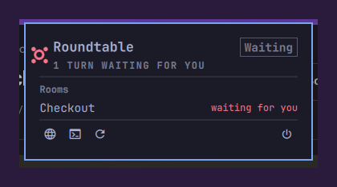

# Roundtable for Omarchy

A bar widget for [Roundtable](https://github.com/ZmagoD/roundtable), the local
room where you and your coding agents share one conversation.



One icon and one panel: whether the service is up, what each room is doing,
and — the reason this exists — whether a participant has stopped mid-turn
waiting for you to approve a tool call. A room only tells you that while its
window is open, which is exactly when you are not looking at it.

## What it does not do

Approve things. Saying yes to a tool call means seeing what it wants to run,
so approval stays in the room, where the request and its context are. This
widget gets you there; it is not a yes button in the corner of the screen.

## What it needs

| | |
|---|---|
| [Roundtable](https://github.com/ZmagoD/roundtable) 0.2+ | the service it reports on, installed separately |
| `bash` | each poll runs the CLI through a login shell, for the PATH |
| `omarchy-launch-or-focus-tui` | ships with Omarchy; opens the terminal client |

Nothing else, and nothing bundled: no daemon of its own, no second Quickshell
process, no network access. It reads only what `roundtable status --json`
prints, over loopback.

## Install

Roundtable itself is a separate install — a background service on your
machine, not part of this plugin:

```sh
curl -fsSL https://raw.githubusercontent.com/ZmagoD/roundtable/main/install.sh | bash
```

Then add the widget:

```sh
omarchy plugin add https://github.com/ZmagoD/roundtable-omarchy-plugin.git --enable
```

Roundtable 0.2 is where `roundtable status --json` came from; the widget reads
"Missing" until `roundtable` is on your PATH, and "Unreachable" against an
older service.

## Removing it

```sh
omarchy plugin remove io.github.zmagod.roundtable
```

That takes the widget off the bar and deletes its checkout. It owns nothing
else: no files outside its own directory, no state, and nothing of Roundtable's
— your rooms are the service's, and it never had them. `omarchy plugin disable
io.github.zmagod.roundtable` parks it instead, keeping the settings.

## Using it

| | |
|---|---|
| Click | open and close the panel |
| Right click | open Roundtable in the browser |
| Middle click | check again now |
| `o` · `t` | open the browser UI · the terminal client |
| `r` · `s` | check again · start or stop the service |

## Settings

Setup > Plugins > Roundtable, or the widget's entry in
`~/.config/omarchy/shell.json`:

| Key | Default | |
|---|---|---|
| `refreshIntervalSec` | `10` | how often to ask |
| `command` | `roundtable` | the executable, if it is not on your PATH |

Each tick runs `roundtable status --json` once, which asks the running service
for counts over loopback. Nothing said in a room is read, sent, or stored.

## Licence

MIT.
